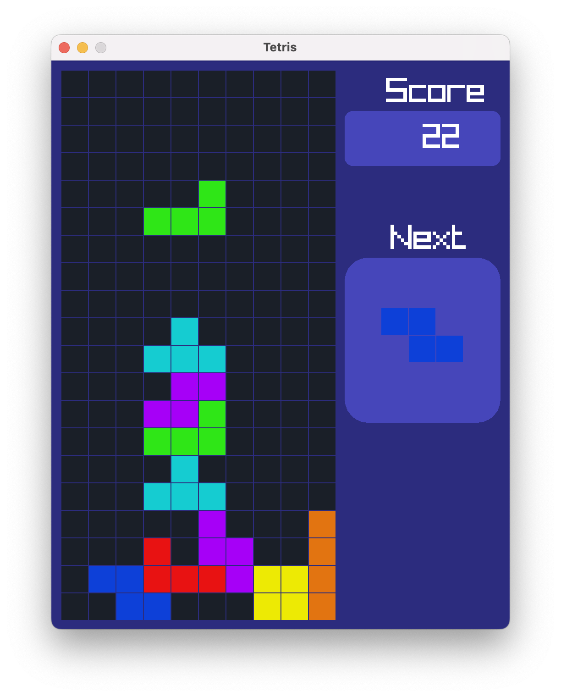

# Tetris | C++, Raylib

This project is Tetris. Created in C++, and using Raylib for graphics rendering.



## How to Run
Download the repository and run:

```make``

Then, run the newly created 'tetris.o' binary file.

(Make sure you have Clang++ version 11+ and Raylib)

## Controls
- **Up-Arrow**: Rotate Block
- **Left-Arrow**: Move Left
- **Right-Arrow**: Move Right
- **Down-Arrow**: Move Down, gaining 1 point
